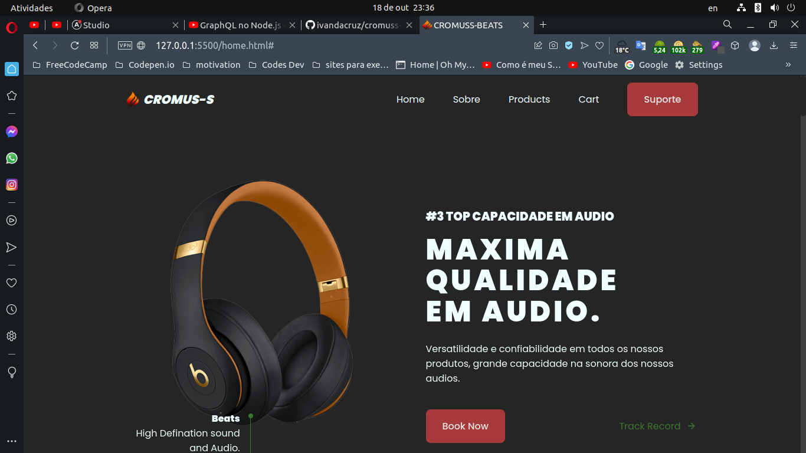
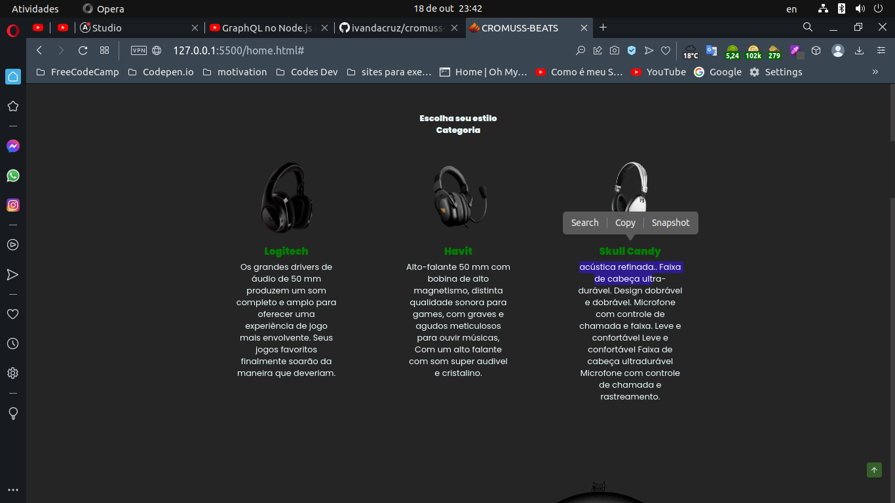
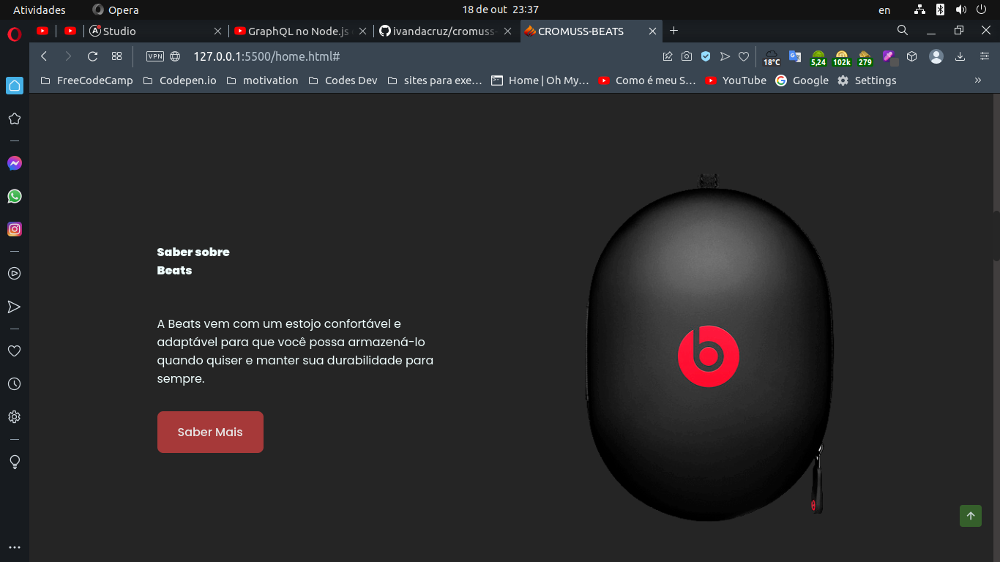
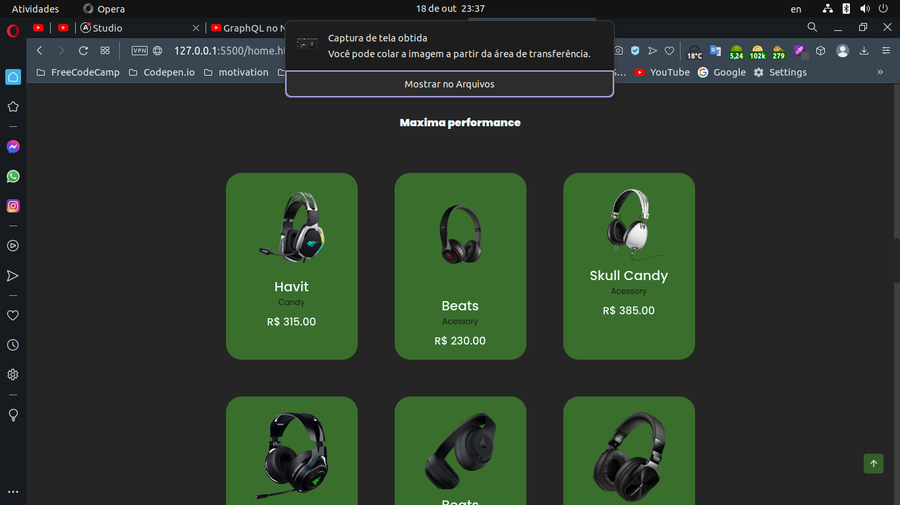
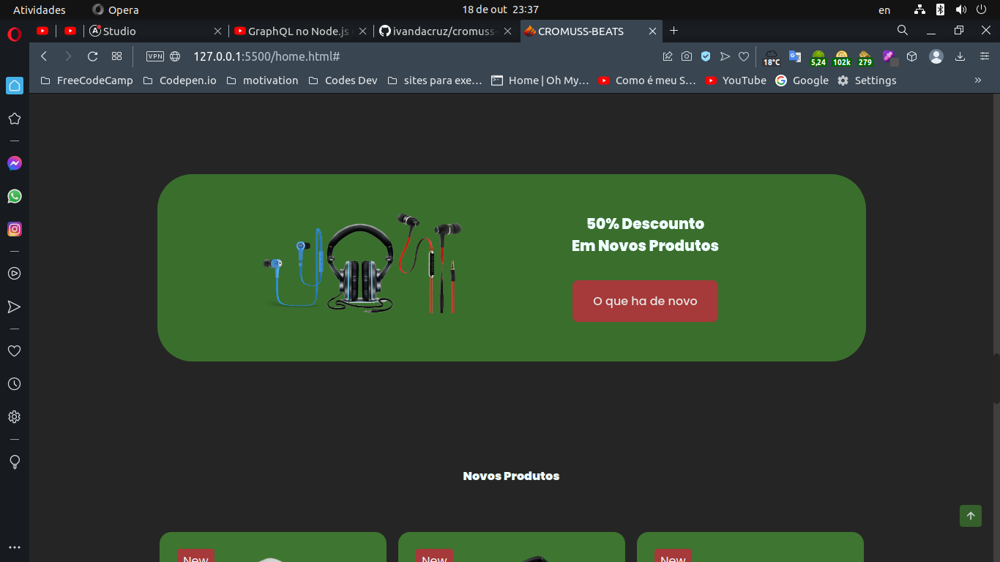
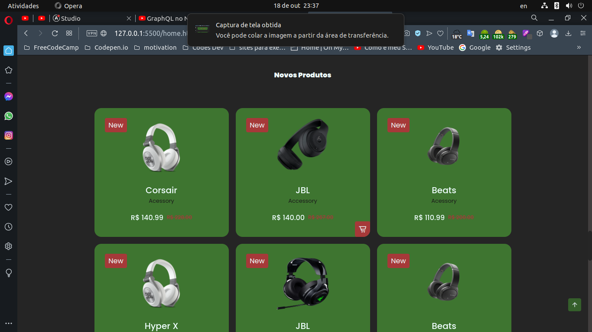
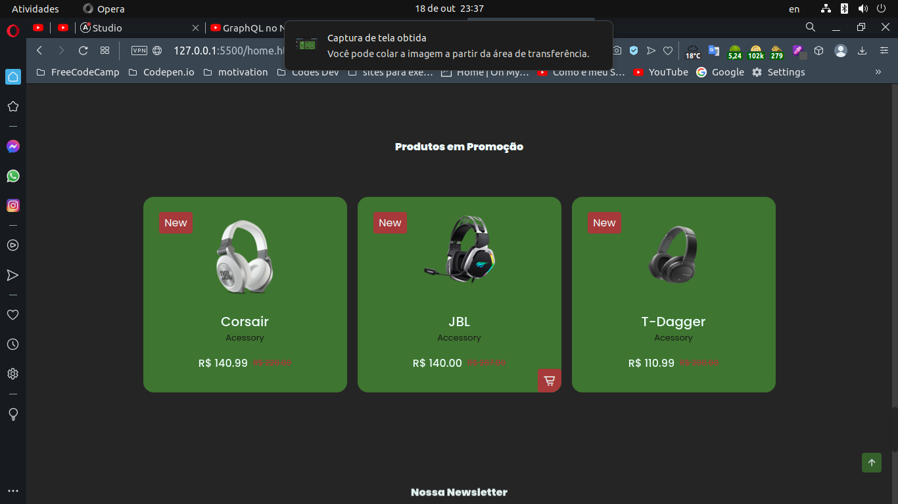
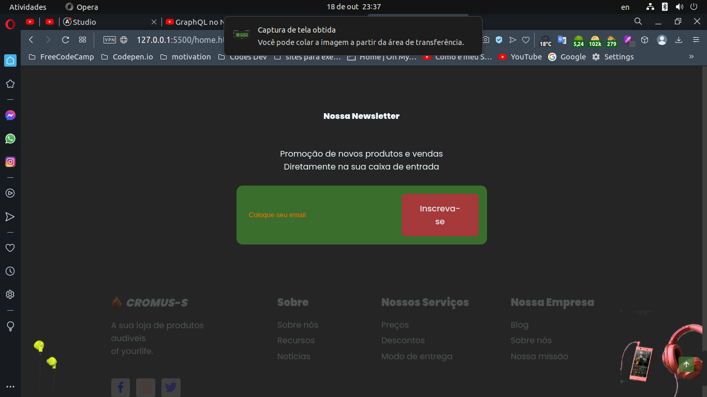

<h1 align="center">🎶 CROMUS-S  PHONES 👍</h1>

## Tecnologias Utilizadas 💻

 

<h1 align="center">📸 Imagems do Projeto  </h1>

    
    
    
    
    
    
    
    

 

<h1 align="center">📚 Motivação </h1>

- Esse projeto foi para fixacao do aprendizado nas tecnologias Front-end utilizados nesse projeto.
- Exercitando logica de programacao nos codigos elaborados para este site.
- Foi feito esse projeto para fixar alguns conhecimento no versionado de codigo github.
- Exercitar conhecimento no deploy de projetos no caso desse site que esta hospedado no github pages e Netlify.

 

<h1 align="center">📦 Deploy </h1>

### Hospedagem em Netlify

 

<MIT align="center">📄 MIT LICENSE </h1>

 

Por: ✒️  [Ivan Da Cruz](https://github.com/ivandacruz) 😃.

